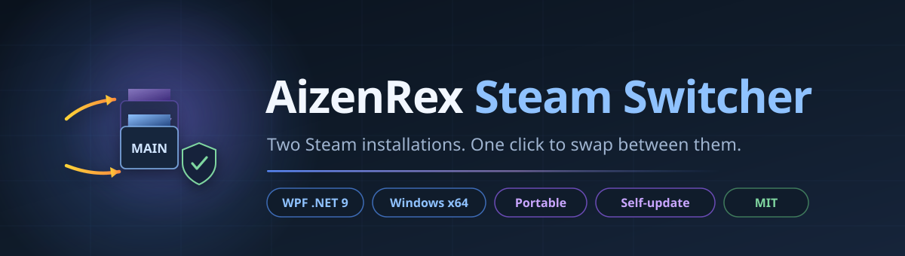
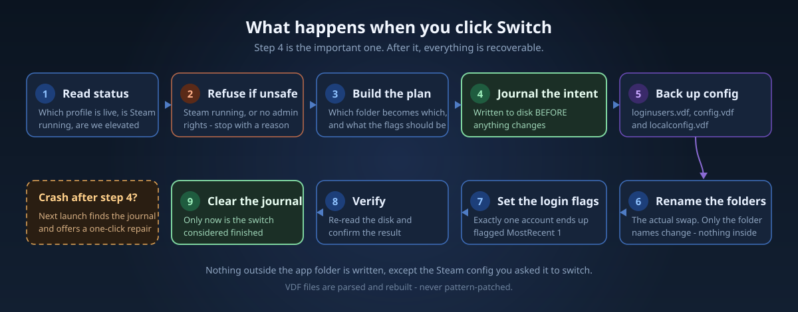
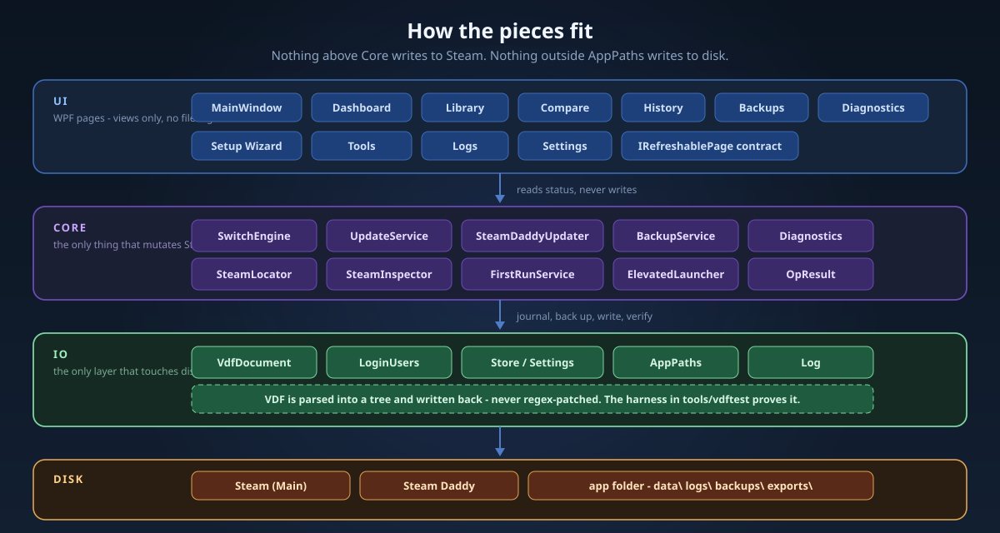

<div align="center">

<picture>
  <source media="(prefers-color-scheme: light)" srcset="docs/assets/banner-light.svg">
  <source media="(prefers-color-scheme: dark)" srcset="docs/assets/banner.svg">
  
</picture>

<br>

**Two Steam installations. One click to swap between them.**

Keeps a *Main* Steam and a *Daddy* Steam side by side and switches which one is live - safely, with a backup before every write and a one-click repair if anything is interrupted.

<br>

[](https://github.com/aizenrexx/AizenRex-Steam-Switcher/actions/workflows/release.yml)
[](https://github.com/aizenrexx/AizenRex-Steam-Switcher/releases/latest)
[](https://github.com/aizenrexx/AizenRex-Steam-Switcher/releases)
[](#requirements)
[](https://dotnet.microsoft.com)
[](license.txt)

<br>

[**Download**](#download--install) &nbsp;&nbsp;|&nbsp;&nbsp; [**Features**](#features) &nbsp;&nbsp;|&nbsp;&nbsp; [**How it works**](#how-it-works) &nbsp;&nbsp;|&nbsp;&nbsp; [**Manual**](docs/manual/) &nbsp;&nbsp;|&nbsp;&nbsp; [**Architecture**](docs/ARCHITECTURE.md) &nbsp;&nbsp;|&nbsp;&nbsp; [**Build & release**](docs/BUILD-AND-RELEASE.md)

</div>

---

## What it is

Steam only ever looks for its installation at **one fixed path**. On a shared PC - two people, two accounts, or one person with a main and a secondary account - that means logging out and back in every single time you want to switch.

AizenRex Steam Switcher makes that a **single button**. It renames the two Steam folders so the one you want sits at the standard path, writes the matching auto-login entry, and backs up the config before it touches anything.

If a switch is ever interrupted - power cut, crash, forced reboot - the app **detects it on the next launch** and offers to repair the folder layout.

> **Nothing is written outside the application folder.** Settings, history, backups and exports all live next to the executable, so the whole tool is portable by design.

<div align="center">

|  |  |
|:---|:---|
| **Runtime** | C# 13 / .NET 9 / `net9.0-windows` |
| **Interface** | WPF with WPF-UI (Fluent) |
| **The switch** | Journaled folder rename + VDF auto-login rewrite |
| **Config format** | Steam VDF - parsed into a tree, never regex-patched |
| **Storage** | Everything under the app folder - no registry, no `%APPDATA%` |
| **Updater** | Built in, from this repository's GitHub releases |
| **Installer** | Inno Setup 6 / per-machine / in-place upgrades |
| **Tests** | VDF harness, 15 checks, run on every release build |

</div>

---

## Why it is safe

<table>
<tr><td width="33%" valign="top">

**It journals before it writes**

The intent hits disk *before* a single folder moves. Whatever happens next - crash, power cut, forced reboot - the app knows exactly what it was in the middle of doing, and can undo it.

</td><td width="33%" valign="top">

**It backs up the account files**

`loginusers.vdf`, `config.vdf` and `localconfig.vdf` are copied before every switch. Backups are never deleted automatically - not by the app, and not by the uninstaller.

</td><td width="33%" valign="top">

**It parses VDF, never patches it**

An earlier implementation used a regex to flip the auto-login flag. It worked with one account and silently corrupted files with two. The current writer loads the tree, changes the node it means to change, and writes it back.

</td></tr>
</table>

### From click to switched

<div align="center">
<picture>
  <source media="(prefers-color-scheme: light)" srcset="docs/assets/switch-flow-light.svg">
  <source media="(prefers-color-scheme: dark)" srcset="docs/assets/switch-flow.svg">
  
</picture>
</div>

Step 4 is the pivot. Everything after it is recoverable, because the app wrote down what it was about to do.

---

## Download & install

Grab the newest build from the [**Releases**](https://github.com/aizenrexx/AizenRex-Steam-Switcher/releases/latest) page.

<div align="center">

| File | What it is |
|:---|:---|
| **`AizenRex-Steam-Switcher-Setup-vX.Y.Z.exe`** | **Installer.** Installs for all users with a Start Menu entry. Installing over an older version upgrades in place - your settings, history and backups are kept. |
| **`AizenRex-Steam-Switcher-vX.Y.Z-Portable.zip`** | **Portable.** Unzip anywhere and run `SteamSwitcher.exe`. Writes nothing outside its own folder. |

</div>

### Requirements

- Windows 10 or Windows 11, **x64**
- No runtime needed - the build is **self-contained**
- Steam installed (the Setup Wizard can find it, or install it for you)

### Administrator rights

The app **must** run as administrator - it renames folders inside `C:\Program Files (x86)`, which Windows blocks otherwise. If it launches without elevation it says so in the status bar and disables switching.

To always launch elevated: right-click the shortcut, open **Properties**, click **Advanced**, and tick **Run as administrator**.

### Verify your download

Every release prints the SHA256 of both files. Check yours before running it:

```powershell
Get-FileHash .\AizenRex-Steam-Switcher-Setup-vX.Y.Z.exe -Algorithm SHA256
```

The result must match the release page exactly. **If it does not, do not run the file.**

<details>
<summary><b>Windows says "Windows protected your PC" - is that a problem?</b></summary>

<br>

No. That blue box is SmartScreen noticing the installer has **no digital signature** - it means Windows does not know who built the file, not that anything was found in it.

Click **More info**, then **Run anyway**. The prompt fades as the download builds reputation.

Removing it permanently requires a **code-signing certificate**. The release pipeline is already wired for one - add repository secrets `WINDOWS_CERT_PFX_BASE64` and `WINDOWS_CERT_PASSWORD` and every future release is signed and timestamped automatically, with no other change. See [docs/SECURITY-AND-SECRETS.md](docs/SECURITY-AND-SECRETS.md).

</details>

---

## Features

<table>
<tr><td width="50%" valign="top">

### Switching

- **One-click swap** between Main and Daddy Steam
- **Automatic backup** before every switch
- **Interrupted-switch detection** with one-click repair
- **Auto-login handling** - the right account ends up flagged
- **Steam running guard** - refuses to swap under a live Steam
- **Optional Steam relaunch** after the swap

</td><td width="50%" valign="top">

### Visibility

- **Dashboard** with live folder and account state
- **Library** view of installed games per profile
- **Compare** the two profiles side by side
- **History** of every switch, with timestamps
- **Backups** browser with restore
- **Diagnostics** for the current folder layout
- **Logs** view with the full application log

</td></tr>
<tr><td valign="top">

### Safety

- Every write is **journaled** before it happens
- **VDF files are parsed and rebuilt**, never pattern-patched
- Unknown accounts are **rejected**, not guessed at
- Backups are **kept, never auto-deleted**
- **Nothing outside the app folder** is touched

</td><td valign="top">

### Quality of life

- **Built-in self-update** - checks GitHub releases in-app
- **SteamDaddy updater** - keeps the companion tool current
- **First-run setup wizard** - can find or install Steam for you
- **Light and dark themes** with a configurable accent colour
- **Credit screen** showing version, build and author

</td></tr>
</table>

---

## How it works

Steam always looks for its installation at one fixed path. The trick is that the *contents* of that path can be swapped.

```
        BEFORE A SWITCH                    AFTER A SWITCH
   ---------------------------       ---------------------------
   Steam          -> MAIN account     Steam          -> DADDY account
   Steam - Daddy  -> DADDY account    Steam - Daddy  -> MAIN account
```

The app reads the current folder layout and the accounts in `loginusers.vdf`, journals what it intends to do, backs up the config files, renames the two Steam folders, rewrites the auto-login flags so exactly one account is `MostRecent`, verifies the result, and only then clears the journal.

### The pieces

<div align="center">
<picture>
  <source media="(prefers-color-scheme: light)" srcset="docs/assets/architecture-light.svg">
  <source media="(prefers-color-scheme: dark)" srcset="docs/assets/architecture.svg">
  
</picture>
</div>

Nothing above **Core** writes to Steam. Nothing outside **AppPaths** writes to disk.

> Full walkthrough: [docs/manual/01-HOW-IT-WORKS.md](docs/manual/01-HOW-IT-WORKS.md)

---

## Documentation

| Document | Covers |
|:---|:---|
| [**00 - Start here**](docs/manual/00-START-HERE.md) | What the project is, in plain language |
| [**01 - How it works**](docs/manual/01-HOW-IT-WORKS.md) | The switch, step by step, and why it is safe |
| [**02 - The codebase**](docs/manual/02-THE-CODEBASE.md) | Every folder and file, explained |
| [**03 - How to modify**](docs/manual/03-HOW-TO-MODIFY.md) | Add a page, a setting, a feature |
| [**04 - Build, test, release**](docs/manual/04-BUILD-TEST-RELEASE.md) | From `git clone` to a published release |
| [**05 - User guide**](docs/manual/05-USER-GUIDE.md) | Using the app day to day |
| [**Architecture**](docs/ARCHITECTURE.md) | Component map and the switch in order |
| [**Build & release**](docs/BUILD-AND-RELEASE.md) | Pipeline reference |
| [**Security & secrets**](docs/SECURITY-AND-SECRETS.md) | What is never committed |

---

## Building from source

```powershell
git clone https://github.com/aizenrexx/AizenRex-Steam-Switcher.git
cd AizenRex-Steam-Switcher

# Build
dotnet build SteamSwitcher.sln -c Release

# Run the VDF harness (15 checks - no Steam data is modified)
dotnet run --project tools/vdftest/vdftest.csproj -c Release

# Portable build
dotnet publish src/SteamSwitcher/SteamSwitcher.csproj -c Release -r win-x64 --self-contained true -p:PublishSingleFile=true -o Distribution/Portable

# Installer (needs Inno Setup 6)
ISCC.exe aizen_steam_installer.iss
```

Requires the **.NET 9 SDK**. See [docs/manual/04-BUILD-TEST-RELEASE.md](docs/manual/04-BUILD-TEST-RELEASE.md) for the long version.

---

## Releasing

Releases are built entirely in the cloud - no local machine involved.

```powershell
git tag v2.2.0
git push origin v2.2.0
```

That triggers [.github/workflows/release.yml](.github/workflows/release.yml), which:

1. Builds and tests on `windows-latest`
2. **Verifies the version matches** in `AppInfo.cs`, the `.csproj`, the installer script and the licence
3. Runs the VDF harness
4. Publishes the portable build and zips it
5. Compiles the Inno Setup installer
6. Signs both, if a certificate is configured
7. Creates the GitHub release with both files attached

> The version check exists so an installed copy can never be told *"you are up to date"* while a newer build sits on the releases page.

### Where the version lives

`src/SteamSwitcher/Core/AppInfo.cs` is the **single source of truth**:

```csharp
public const string CurrentVersion = "2.2.0";
```

Everything else reads it at runtime. When you release, bump it together with the mirrors the pipeline checks - or the build fails on purpose.

---

## Updates

**Settings > About > Updates** shows the installed version, checks GitHub, and installs a newer release in place.

- The installer route **preserves your settings, history and backups**
- A portable-only release opens the releases page instead
- Downloads are **verified against the published SHA256** before anything runs
- A build newer than the published release is never "downgraded"

---

## Safety notes

- **Your Steam account data never leaves your PC.** Nothing is uploaded anywhere.
- **Backups are never deleted automatically.** They live in the app's `backups` folder until you remove them.
- **The app refuses to switch while Steam is running**, unless you turn that guard off in Settings.
- **A failed switch is recoverable.** The journal survives a crash and the app offers the repair on next launch.
- **An uninstall never touches your Steam installations** or your backups.

---

## Credits

<div align="center">

|  |  |
|:---|:---|
| **Author** | Aizenrex x Riyad |
| **Role** | Design / Engineering / Maintenance |
| **Licence** | MIT - see [license.txt](license.txt) |

</div>

If you use, modify or redistribute this project, **keep the credit in place**.

---

## FAQ

<details>
<summary><b>Will this get me banned from Steam?</b></summary>

<br>

No. It does not modify Steam, inject into it, or touch the game files. It renames two folders on your own disk and writes the standard auto-login flag that Steam itself uses. Valve's rules cover cheating and account sharing in the sense of letting others play on your account - this is a local folder manager.

</details>

<details>
<summary><b>What happens to my games?</b></summary>

<br>

Nothing. Both installations keep their own `steamapps` folder. Switching changes which one Steam sees at the standard path - the games themselves are untouched and stay where they are.

</details>

<details>
<summary><b>Can I lose my login?</b></summary>

<br>

The app backs up `loginusers.vdf`, `config.vdf` and `localconfig.vdf` before every switch, and the VDF writer only ever changes the auto-login flags. Even if a switch is interrupted mid-way, the journal lets the app restore the previous layout.

</details>

<details>
<summary><b>Why does it need administrator rights?</b></summary>

<br>

`C:\Program Files (x86)` is a protected location. Renaming a folder inside it requires elevation. There is no way around that without moving Steam, which would break other things.

</details>

<details>
<summary><b>Why does SmartScreen warn me?</b></summary>

<br>

The installer is not signed with a paid code-signing certificate, so Windows has no reputation for it yet. *More info, then Run anyway* is the normal path. The pipeline will sign automatically the moment a certificate is configured.

</details>

<details>
<summary><b>Does it work with a non-default Steam location?</b></summary>

<br>

Yes. The Setup Wizard detects Steam from the registry and lets you point at a custom install. Both profiles can live anywhere.

</details>

---

<div align="center">

<br>

**AizenRex Steam Switcher**

Built and maintained by **Aizenrex x Riyad**

<br>

[**Releases**](https://github.com/aizenrexx/AizenRex-Steam-Switcher/releases) &nbsp;&nbsp;|&nbsp;&nbsp;
[**Issues**](https://github.com/aizenrexx/AizenRex-Steam-Switcher/issues) &nbsp;&nbsp;|&nbsp;&nbsp;
[**MIT Licence**](license.txt)

</div>